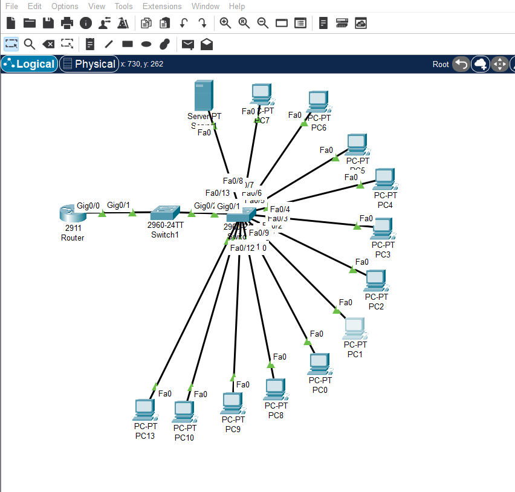

# Cisco-Based Enterprise Network with VLANs & Inter-VLAN Routing

## 📌 Project Overview

This project demonstrates the design and implementation of a Cisco-based enterprise network using Cisco Packet Tracer.

The network is divided into multiple VLANs to provide logical network segmentation for different departments.

## 🌐 Network Topology

## 🏢 VLAN Structure

| VLAN | Department | Network |
|------|------------|---------|
| 10 | Management | 192.168.10.0/24 |
| 20 | HR | 192.168.20.0/24 |
| 30 | IT | 192.168.30.0/24 |
| 40 | Finance | 192.168.40.0/24 |
| 50 | Server | 192.168.50.0/24 |

## ⚙️ Technologies Implemented

- VLANs
- 802.1Q Trunking
- Router-on-a-Stick
- Inter-VLAN Routing
- DHCP
- Access Control Lists (ACL)
- Port Security
- SSH Remote Management
- Cisco IOS
- Cisco Packet Tracer

## 🔐 Network Security

An ACL was configured to prevent the HR VLAN from accessing the Finance VLAN while allowing HR to access other required network resources such as the Server VLAN.

Port Security was also configured on an end-device access port using sticky MAC address learning.

SSH was configured to provide secure remote management of the switch.

## 🧪 Testing

The following were tested:

- VLAN connectivity
- Trunk connectivity
- DHCP IP address allocation
- Inter-VLAN communication
- ACL restrictions
- Port Security
- SSH remote management

## 🛠️ Tools

- Cisco Packet Tracer
- Cisco IOS

## 📂 Project File

The Cisco Packet Tracer `.pkt` file is included in this repository.

